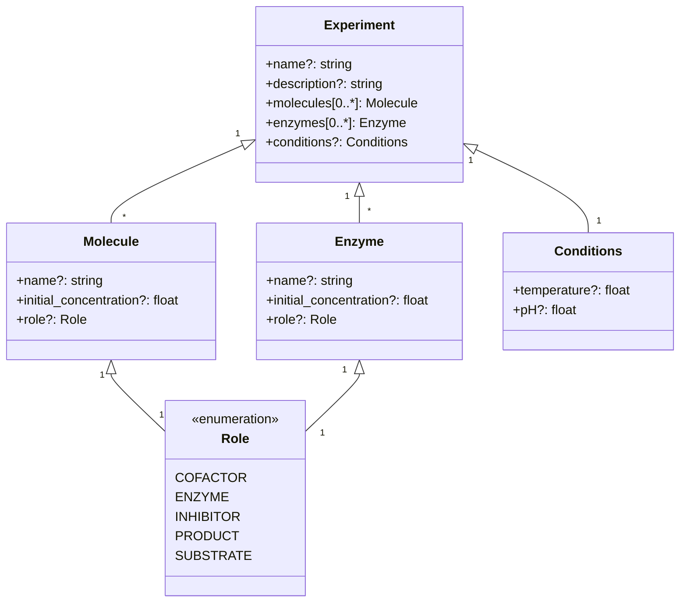

```mermaid
classDiagram
    %% Class definitions with attributes
    class Experiment {
        +name?: string
        +description?: string
        +molecules[0..*]: Molecule
        +enzymes[0..*]: Enzyme
        +conditions?: Conditions
    }

    class Molecule {
        +name?: string
        +initial_concentration?: float
        +role?: Role
    }

    class Enzyme {
        +name?: string
        +initial_concentration?: float
        +role?: Role
    }

    class Conditions {
        +temperature?: float
        +pH?: float
    }

    %% Enum definitions
    class Role {
        <<enumeration>>
        COFACTOR
        ENZYME
        INHIBITOR
        PRODUCT
        SUBSTRATE
    }

    %% Relationships
    Experiment "1" <|-- "*" Molecule
    Experiment "1" <|-- "*" Enzyme
    Experiment "1" <|-- "1" Conditions
    Molecule "1" <|-- "1" Role
    Enzyme "1" <|-- "1" Role
```